# Lưu Đồ Chu Trình Tự Động Máy Nitto (Nitto Automated Production Sequence)

> File sơ đồ thiết kế gốc: [`Nitto_Motion_Sequence.drawio`](Nitto_Motion_Sequence.drawio)  
> Dùng để mở, chỉnh sửa trực tiếp bằng ứng dụng **Draw.io**, extension **Draw.io Integration** trên VS Code, hoặc trên web **[app.diagrams.net](https://app.diagrams.net)**.

---

## 1. Sơ đồ Lưu đồ Thuật toán (Flowchart)

```mermaid
flowchart TD
    classDef state fill:#252526,stroke:#007ACC,stroke-width:2px,color:#FFFFFF;
    classDef decision fill:#332A15,stroke:#FF8C00,stroke-width:1.5px,color:#FFD700;
    classDef io fill:#1E3320,stroke:#2E8B57,stroke-width:1.5px,color:#00FF7F;
    classDef pass fill:#162D1C,stroke:#2E8B57,stroke-width:2px,color:#00FF7F;
    classDef fail fill:#381717,stroke:#DC143C,stroke-width:2px,color:#FF6B6B;

    S0["<b>STATE: IDLE (Standby)</b><br/>• Trục tỳ ở cữ trên 0.0 mm<br/>• Đèn tháp Standby / Sẵn sàng"]:::state
    
    S1["<b>STATE: CHECKING READY</b><br/>• Kiểm tra EtherCAT Master State 6 (OP)<br/>• Mở phanh motor qua PCIe DO 0<br/>• CiA 402 Reset Alarm & Servo ON"]:::state

    C1{"Master OP &<br/>Servo ON?"}:::decision
    ERR["<b>STATE: ERROR</b><br/>Khóa chu trình, báo lỗi UI"]:::fail

    S2["<b>STATE: WAITING TRIGGER</b><br/>Công nhân đặt tệp sản phẩm vào Jig<br/>Chờ nhấn đồng thời 2 nút an toàn IDEC<br/>(Cửa sổ đồng bộ 500 ms, lọc dội 30 ms)"]:::state
    IO1["<b>Card PCIE-E2I12O16</b><br/>DI 1 (X02): Nút Trái<br/>DI 2 (X03): Nút Phải<br/>Debounce: 30 ms"]:::io

    C2{"Cả 2 nút DI 1 & DI 2<br/>cùng HIGH trong 500ms?"}:::decision

    S3["<b>STATE: CLAMPING DOWN</b><br/>• Xung Reset Loadcell DO 3 (200 ms)<br/>• Hạ trục Leadshine EL7 tới ClampingPosition<br/>• Chạy jog âm dò lực (ClampJogVelocity 10 mm/s)<br/>• Bảo vệ cữ mềm âm SoftwareLimitNegative"]:::state
    IO2["<b>Loadcell Bongshin BS-205-35</b><br/>PCIe DI 10 (X11): Load Cell OK<br/>(Đạt ngưỡng lực ép phẳng tệp phôi)"]:::io

    C3{"Đạt lực ép DI 10<br/>(Load Cell OK)?"}:::decision

    S4["<b>STATE: TRIGGERING VISION</b><br/>• Dừng trục giữ lực ép cố định Stop(0)<br/>• Dwell time: 150 ms ổn định phôi<br/>• Kích hoạt xung đèn/chiếu sáng"]:::state

    S5["<b>STATE: PROCESSING VISION</b><br/>• Kích hoạt camera chụp ảnh biên dạng<br/>• Cognex VisionPro đếm 100 pcs<br/>• Kiểm tra định hướng không bị ngược mặt<br/>• Hỗ trợ cờ ForceVisionOk test"]:::state

    S6["<b>STATE: UNCLAMPING UP (Retract)</b><br/>• Nâng trục mở kẹp về 0.0 mm (80 mm/s)<br/>• Đợi trục về vị trí chờ an toàn"]:::state

    S7["<b>SAFETY: ANTI-TIE-DOWN</b><br/>Bắt buộc công nhân nhả cả 2 nút IDEC (DI 1 & DI 2)<br/>(Chống chèn hoặc đè giữ nút bấm liên tục)"]:::state

    C4{"Kết quả Vision<br/>Đủ 100pcs & Đúng mặt?"}:::decision

    OK["<b>RESULT: PASS (OK)</b><br/>• Ghi nhận chu trình ĐẠT<br/>• Tăng TotalCycleCount + 1"]:::pass
    NG["<b>RESULT: FAIL (NG)</b><br/>• Báo trạng thái NG chu trình<br/>• Lưu ảnh lỗi & Cảnh báo UI"]:::fail

    FIN["<b>STATE: FINISHING CYCLE</b><br/>Tính Cycle Time, ghi Log & Database"]:::state

    S0 --> S1
    S1 --> C1
    C1 -- Không --> ERR
    C1 -- Sẵn sàng --> S2
    IO1 -. Tín hiệu .-> S2
    S2 --> C2
    C2 -- Chưa đủ nút / Quá 500ms --> S2
    C2 -- Đủ 2 nút đồng bộ --> S3
    IO2 -. Tín hiệu .-> S3
    S3 --> C3
    C3 -- Chưa đạt --> S3
    C3 -- Đạt lực ép DI 10 --> S4
    S4 --> S5
    S5 --> S6
    S6 --> S7
    S7 --> C4
    C4 -- PASS --> OK
    C4 -- FAIL --> NG
    OK --> FIN
    NG --> FIN
    FIN --> S0
```

---

## 2. Bảng Ánh Xạ Phần Cứng I/O Card PCIe (`PcieE2I12O16IOControl` / `IOConfig`)

| Kênh (0-based) | Ký Hiệu PLC/Card | Property trong `IOConfig` | Thiết Bị Vật Lý | Ý Nghĩa Chức Năng |
| :---: | :---: | :--- | :--- | :--- |
| **DI 1** | X02 | `TriggerBtnLeftDIBit` | Nút nhấn IDEC YW1L (Trái) | Nút khởi động chu trình bên trái (yêu cầu 2 tay) |
| **DI 2** | X03 | `TriggerBtnRightDIBit` | Nút nhấn IDEC YW1L (Phải) | Nút khởi động chu trình bên phải (yêu cầu 2 tay) |
| **DI 9** | X10 | `LoadCellLowDIBit` | Cảm biến Loadcell Low | Tín hiệu tải thấp (dự phòng) |
| **DI 10** | X11 | `ForceReachedDIBit` | Bongshin Loadcell BS-205-35 | Tín hiệu đạt lực ép mục tiêu (Load Cell OK) để dừng trục Leadshine EL7 |
| **DI 11** | X12 | `LoadCellHighDIBit` | Cảm biến Loadcell High | Tín hiệu tải cao (dự phòng) |
| *N/A* | - | `SystemStopDIBit` | Nút E-Stop khẩn cấp | Dừng ngắt an toàn (mặc định `-1`, bypass khi chưa nối dây) |
| **DO 0** | Y01 | `BrakeServoDOBit` | Cuộn hút phanh động cơ Leadshine | Mở phanh khi Servo ON (1), đóng phanh khi Servo OFF (0) |
| **DO 1** | Y02 | `Button1LampDOBit` | Đèn nút nhấn IDEC Trái | Sáng đèn báo trạng thái nút nhấn 1 |
| **DO 2** | Y03 | `Button2LampDOBit` | Đèn nút nhấn IDEC Phải | Sáng đèn báo trạng thái nút nhấn 2 |
| **DO 3** | Y04 | `LoadCellResetDOBit` | Reset bộ hiển thị Loadcell | Phát xung 200 ms trước khi hạ trục kẹp phôi |
| **DO 4** | Y05 | `LoadCellHoldDOBit` | Giữ giá trị cân Loadcell | Giữ trạng thái hiển thị lực ép |
| **DO 8** | Y09 | `Channel1LightTriggerDOBit` | Xung kích đèn chiếu sáng Kênh 1 | Kích hoạt bộ điều khiển đèn khi chụp ảnh biên dạng |
